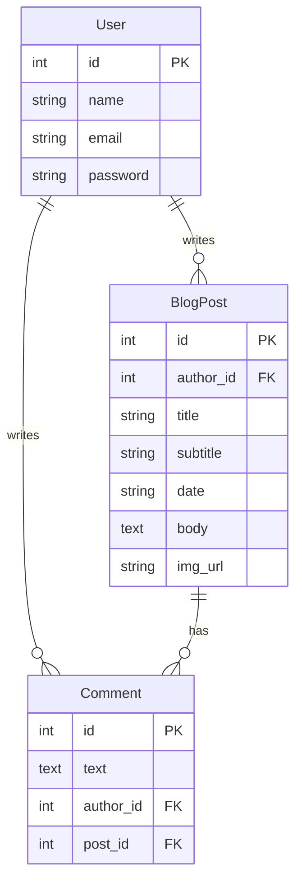

# Python CLI Password Manager


This app serves as a technical showcase of applied cryptography, focusing on zero-knowledge architecture where secrets are encrypted before they ever touch the database.

> **Note:** This is a portfolio project. For my active personal blog, please visit [Daniel Adrian's site](https://truedaniyyel.com).

## Known Issues / Future Improvements
* **CKEditor 4 Warning:** This project uses `Flask-CKEditor`, which relies on the End-of-Life CKEditor 4. In a production environment, I would migrate this to a modern frontend framework (React/Vue) with CKEditor 5 or utilize a Markdown editor like `SimpleMDE` to ensure long-term security compliance.

## Key Features

* **User Authentication:** Login and registration using `Werkzeug` (pbkdf2:sha256 with salting) and `Flask-Login` for session management.
* **Role-Based Access Control:** Custom decorators (`@admin_only`) ensure only the administrator can Create, Edit, or Delete posts.
* **Database Relationships:** `One-to-Many` relationships linking **Users**, **Blog Posts**, and **Comments** via `SQLAlchemy`.
* **Rich Text Editor:** `CKEditor` for formatting blog posts.
* **Security:** `Bleach` implementation to sanitize comments and prevent XSS attacks. 
* **Dynamic UI:** Responsive design using `Bootstrap 5` and `Jinja2` templating.
* **Gravatar Support:** auto-generated user avatars.

## Tech Stack

* **Backend:** Python, Flask
* **Database:** SQLite, SQLAlchemy
* **Frontend:** HTML5, CSS3, Bootstrap 5, Jinja2
* **Forms:** WTForms, Flask-WTF

## Database Schema


## How to Run Locally


### 1. Clone the repository
```bash
git clone [https://github.com/truedaniyyel/python-blog.git](https://github.com/truedaniyyel/python-blog.git)
cd python-blog
```

### 2. Install Dependencies
```bash
pip install -r requirements.txt
```

### 3. Configure Environment Variables
Create a .env file in the project root directory and add your secret key:
```
FLASK_KEY=your_flask_key_here
DB_URI=your_db_uri_here
```

### 4. Run the Application
```bash
python main.py
```

## Deployment & Production
You can run this project on platforms like Render, Railway, or Heroku.

### 1. WSGI Server
While `main.py` uses the default Flask development server, production environments should use a production-grade WSGI server.
* **Linux/Mac (Render/Heroku):** `gunicorn`
* **Windows:** `waitress`

### 2. Database Migration (PostgreSQL)
The application is currently configured to use **SQLite** for local development. To switch to **PostgreSQL** for production:
1. Install the adapter: `pip install psycopg2-binary`
2. Follow the hosting platform's instructions to configure the database connection variables.
