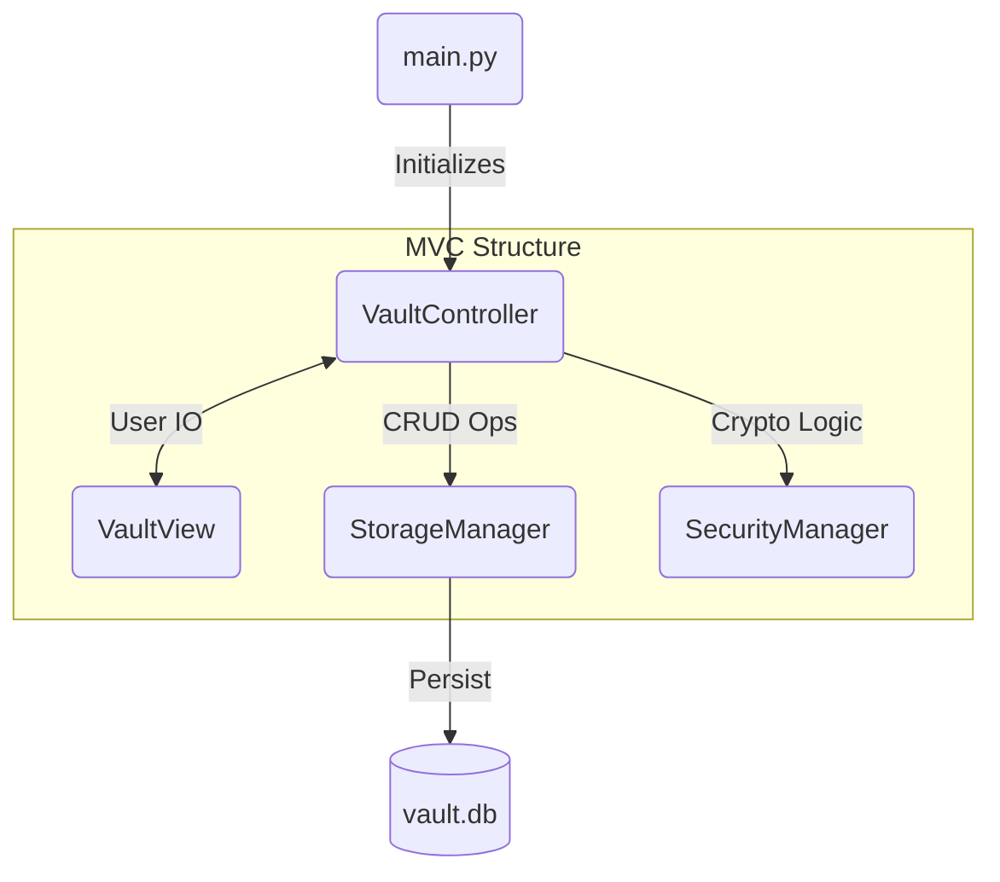
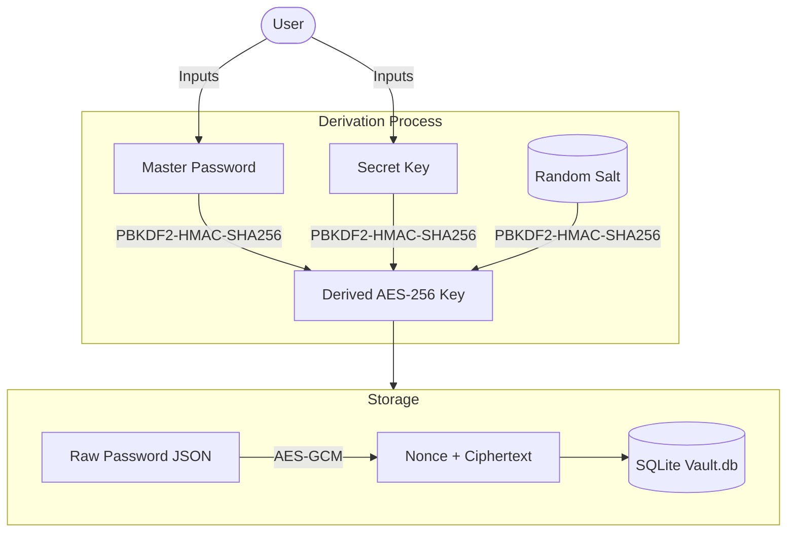

# Python CLI Password Manager


This app serves as a technical showcase of applied cryptography, focusing on zero-knowledge architecture where secrets are encrypted before they ever touch the database.

> **Note:** This is a portfolio project demonstrating security concepts.

## Key Features

* **Zero-Knowledge Encryption:** Uses `AES-256-GCM` to ensure data integrity. The database only ever stores encrypted blobs.
* **Two-Factor Key Derivation:** Security relies on both a user-chosen **Master Password** and a system-generated **Secret Key**, making rainbow table attacks significantly harder.
* **Clipboard:** Passwords are copied to the clipboard and automatically cleared after 60 seconds.
* **Search:** Quickly filter entries by Website or Username.
* **Cross-Platform:** Includes a build script to generate standalone executables for Windows, macOS, and Linux.
* **Testing:** Includes unit tests that validate cryptographic math and database transactions.

## Tech Stack

* **Backend:** Python
* **Security:** Cryptography (PBKDF2HMAC, AESGCM), Secrets module
* **Database:** SQLite
* **Utilities:** Pyperclip (Clipboard), UV (Package Management)
* **Build:** PyInstaller

## Software Architecture (MVC)


## Security Architecture


## How to Run Locally


### 1. Clone the repository
```bash
git clone [https://github.com/truedaniyyel/python-cli-password-manager.git](https://github.com/truedaniyyel/python-cli-password-manager.git)
cd python-cli-password-manager
```

### 2. Install Dependencies
This project uses uv for modern package management.
```bash
uv sync
```

### 3. First Time Setup
Run the application to initialize the vault.
```bash
python main.py
```
You will be prompted to create a Master Password. The app will then generate a Secret Key, which you must save immediately.

### 4. Run Tests
```bash
python tests.py
```

## Build & Distribution
You can bundle this project into a standalone executable (.exe) so Python is not required on the target machine.

### 1. Install PyInstaller
```bash
uv add --dev pyinstaller
```

### 2. Run Build Script
The included build.py handles OS detection (Windows/Mac/Linux) and icon embedding.
```bash
python build.py
```

### 3. Output
The standalone file will be generated in the dist/ folder.
* **Windows:** `dist/cooking.exe`
* **macOS:** `dist/cooking`
